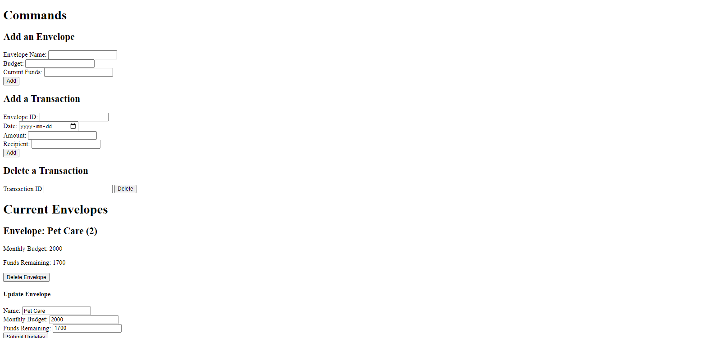

# Express Budgeting App
> I built this API + front end + back end to satisfy the "Budgeting Project" for my "Back-End Engineer Career Path" program on Code Academy. The project consists of an API, a database for storing data, and a simple front end that allows a user to plan and monitor their personal budget using the [envelope method](https://www.thebalance.com/what-is-envelope-budgeting-1293682). 

## Table of Contents
* [General Info](#general-information)
* [Technologies Used](#technologies-used)
* [Features](#features)
* [Screenshots](#screenshots)
* [Setup](#setup)
* [Project Status](#project-status)
* [Room for Improvement](#room-for-improvement)
* [Acknowledgements](#acknowledgements)

## General Information
The purpose of this project was to demonstrate competancy in the following areas by building both an API, database, and front end:
- Ability to write HTTP endpoints using express.js. 
- Ability to use express middleware. 
- Ability to build a dynamic front end using HTML and a linked Javacript file. 
- Ability to link the front end to the backend using asynchronous promises (async/await + fetch). 
- Ability to build a database using PostgreSQL. 
- Ability to connect the database to the server using the "node-postgres" module. 

## Technologies Used
- Express.js - version 4.17.1
- Postgres - version 13.3

## Features
List the ready features here:
- The simple front end (built with HTML and Javascript) allows the user to view currently created envelopes, add new envelopes, delete individual envelopes, and update individual envelopes. The front end also allows users to add, delete, and modify transactions (expenses such as buying food or fixing a car). The server then automatically updates the relevant envelope. For example, if the user added a transaction for buying **catfood**, the server would reduce the budget in the **Pet** envelope.   
- Back end server with endpoints for GET, POST, PUT, and DELETE HTTP requests (either from front-end or services like Postman). 
- PostgreSQL database for storing envelopes and transactions. 

## Screenshots

## Setup
Start by downloading the repository to your local computer and navigating to the root directory. First of all, you will need to create the database. Download postgreSQL, set it up, and create a database. You should name the database **envelope_budget_db** or name it something different and modify the `DB_DATABASE` variable from the `.env` file to match. Then, run the query commands in init.sql file to create the proper tables. You will then need to create a user to access the database. The default user is named **me2** with **me3** as the password, but you can create whatever user you like and modify the `DB_USER` and `DB_PASSWORD` variables from the `.env` file to match. 

The server can then be initialized using the `node app.js` command in your terminal. The server is hosted at **http://localhost:3000/**, although the port can be changed by editing the `port` variable in the `//Initialize Express` section of the app.js file. To access the front end, go to **http://localhost:3000/**. 

Note, the app has been slightly modified to allow for deployment to Heroku. In order to undo these changes to allow for local deployment, you will need to make the following edits:
- Change the `isProduction` variable in the `front-end-scripts.js` file from `true` to `false`. 
- For both forms in the `index.html` file, change the path for the `action` attribute from **https://envelope-budget-app.herokuapp.com/** to **http://localhost:3000/**. 

## Project Status
Project is: _complete_

## Room for Improvement
Room for improvement:
- A prettier front end (add some CSS).
- Better client side and server side form validation.
- Some test cases.  
- Security features such as rate limiting. 

## Acknowledgements
Full credit to the Code Academy course. 
